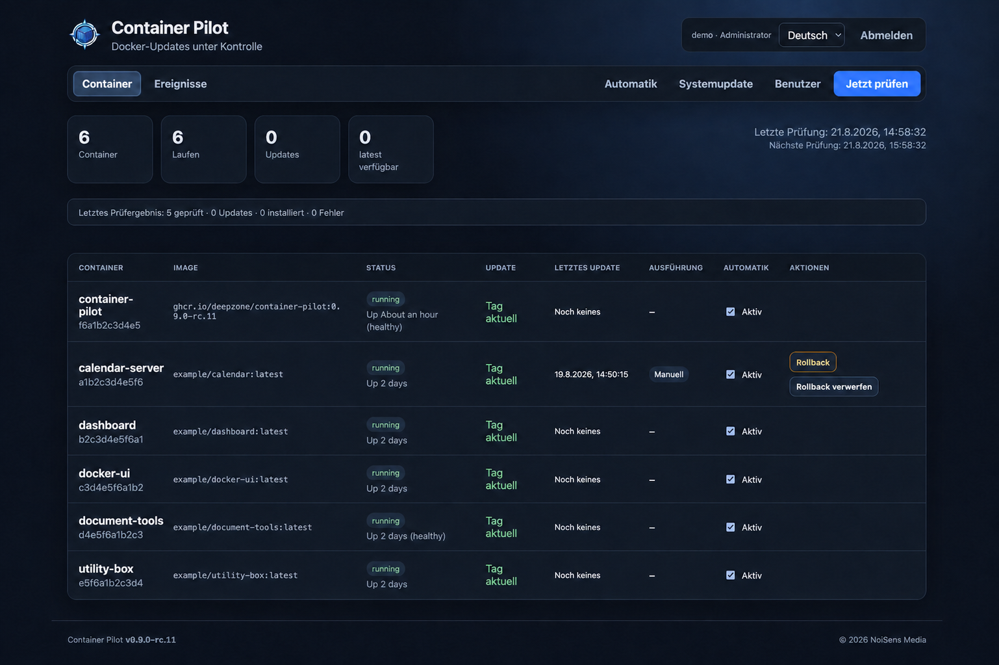
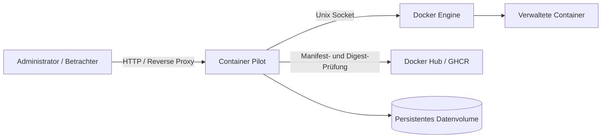

<div align="center">
  
  <h1>Docker Update Manager – Container Pilot</h1>
  <p><strong>Moderne deutsche Weboberfläche zur kontrollierten Prüfung und Installation von Docker-Image-Updates.</strong></p>
  <p>
    
    
    
    
    
    <a href="https://buymeacoffee.com/mail9l"></a>
  </p>
</div>

**Container Pilot ist eine eigenständige Watchtower-Alternative für die zentrale Verwaltung von Docker-Updates.** Die deutschsprachige Weboberfläche erkennt laufende und gestoppte Container, vergleicht lokale Images mit den Registry-Manifesten und ermöglicht kontrollierte manuelle oder automatische Aktualisierungen.

Der Schwerpunkt liegt auf einem nachvollziehbaren Update-Workflow mit **konfigurierbaren Prüfintervallen, Freigabe pro Container, optionaler Sofortinstallation und automatischem Rollback**. Bei Images mit einem festen Tag prüft Container Pilot zusätzlich, ob ein `latest`-Tag vorhanden ist, und bietet einen bewussten Wechsel über die Weboberfläche an.

> **Projektstatus:** Version 0.9.0-rc.1 ist ein Release Candidate. Die Update-Engine besitzt Healthcheck-Validierung, Aktionssperren und Docker-Integrationstests. Vor dem Stable-Release ist ein kontrollierter Praxistest mit den eigenen Stacks vorgesehen.

## Einblick



*Vollständige Containerübersicht mit Images, Laufzeitstatus, Update-Zustand, Ausführungsart und Automatik-Freigaben.*

## Warum ein eigener Docker Update Manager?

- **Zentrale Docker-Weboberfläche:** Containerstatus, Images, verfügbare Updates und Ereignisse an einem Ort einsehen
- **Kontrollierte Automatik:** Prüfintervall und automatische Installation global steuern
- **Freigabe pro Container:** Nur ausdrücklich aktivierte Container automatisch aktualisieren
- **Manuelle Entscheidungen:** Updates und Wechsel auf `latest` gezielt über die Oberfläche auslösen
- **Nachvollziehbarer Betrieb:** Aktionen, Fehler und Anmeldungen im Ereignisprotokoll verfolgen
- **Interner Mehrbenutzerbetrieb:** Administratoren und rein lesende Benutzer getrennt verwalten

## Funktionen der Docker-Weboberfläche

| Bereich | Möglichkeiten |
| --- | --- |
| **Übersicht** | Anzahl der Container, laufende Instanzen, verfügbare Updates, vorhandene `latest`-Tags sowie letzte und nächste Prüfung anzeigen |
| **Container** | Name, Container-ID, Image, Laufzeitstatus, Updatezustand sowie Zeitpunkt und Art des letzten Updates in einer gemeinsamen Liste einsehen |
| **Update-Prüfung** | Docker Hub und GHCR anhand der Image-Manifeste und Digests prüfen; Fortschritt und Abschlussresultat direkt anzeigen |
| **Automatik** | Prüfung aktivieren, Intervall zwischen 1 Minute und 7 Tagen festlegen und Sofortinstallation ein- oder ausschalten |
| **Richtlinien** | Automatische Installation individuell pro Container freigeben oder sperren |
| **Manuelle Updates** | Gefundene Updates unmittelbar installieren und Container mit bestehender Konfiguration neu erstellen |
| **Tag-Wechsel** | Existenz von `latest` prüfen und bei Bedarf bewusst auf diesen Tag wechseln |
| **Rollback** | Bei Startfehler, negativem Healthcheck oder Timeout automatisch den bisherigen Container wiederherstellen; nach erfolgreichen Updates einen manuellen Rollback auf den exakten vorherigen Image-Digest anbieten |
| **Aktionssperren** | Update und Rollback pro Container serialisieren und laufende Vorgänge sichtbar machen |
| **Benutzer** | Administrator- und Viewer-Konten über die Weboberfläche verwalten |
| **Ereignisse** | Prüf-, Update-, Fehler-, Benutzer- und Anmeldeereignisse in einem eigenen Menüpunkt nachvollziehen |

## Architektur: Weboberfläche, Docker API und Registry



Container Pilot kommuniziert direkt mit der lokalen Docker Engine über deren Unix-Socket. Registry-Prüfungen erfolgen für öffentliche Images über die Manifest-Endpunkte von Docker Hub und GHCR. Benutzer, Einstellungen, Container-Richtlinien, Prüfergebnisse und Ereignisse werden in einem persistenten Docker-Volume gespeichert.

## Voraussetzungen für Container Pilot

- Docker Engine mit Docker Compose
- Zugriff auf `/var/run/docker.sock`
- ausgehender HTTPS-Zugriff auf die verwendeten Container-Registries
- ein geschütztes internes Managementnetz oder ein abgesicherter Reverse Proxy

## Container Pilot mit Docker Compose starten

Repository klonen und Secret-Verzeichnis vorbereiten:

```bash
git clone https://gitlab.noisens.de/nsens/container-pilot.git
cd container-pilot
mkdir -p secrets
```

Ein starkes initiales Administratorkennwort hinterlegen:

```bash
openssl rand -base64 32 > secrets/admin_password
chmod 600 secrets/admin_password
```

Anschließend den Container bauen und starten:

```bash
docker compose up -d --build
```

Die Weboberfläche ist standardmäßig unter `http://127.0.0.1:3080` beziehungsweise der Adresse des Docker-Hosts auf Port `3080` erreichbar. Für den dauerhaften Betrieb empfiehlt sich die Bereitstellung in einem internen Managementnetz oder hinter einem abgesicherten Reverse Proxy.

Beim ersten Start wird der Benutzer aus `CP_ADMIN_USER` angelegt. Das Kennwort aus dem Docker Secret wird nur für die initiale Erstellung verwendet; persistent gespeichert wird ausschließlich der gesalzene scrypt-Hash.

## Umgebungsvariablen

| Variable | Standard | Beschreibung |
| --- | --- | --- |
| `TZ` | `Europe/Berlin` | Zeitzone des Containers |
| `CP_PORT` | `8080` | interner Port der Weboberfläche |
| `CP_ADMIN_USER` | `admin` | initialer Administratorname |
| `CP_ADMIN_PASSWORD_FILE` | `/run/secrets/admin_password` | Datei mit dem erforderlichen initialen Administratorkennwort |
| `CP_SCAN_INTERVAL_MINUTES` | `60` | initiales Prüfintervall; spätere Änderungen erfolgen in der Weboberfläche |
| `CP_AUTO_DEFAULT` | `false` | Standardwert für die automatische Installation bei noch nicht konfigurierten Containern |
| `CP_HEALTH_TIMEOUT_SECONDS` | `120` | maximale Wartezeit auf einen erfolgreichen Docker-Healthcheck |
| `CP_STARTUP_GRACE_SECONDS` | `5` | Beobachtungszeit für Container ohne eigenen Healthcheck |
| `CP_SECURE_COOKIE` | `false` | `true` hinter einem HTTPS-Reverse-Proxy; markiert das Sitzungscookie als Secure |
| `CP_STORE_FILE` | `/data/state.json` | Pfad der persistenten Zustandsdatei |
| `DOCKER_SOCKET` | `/var/run/docker.sock` | Pfad zum Docker-Unix-Socket |

## Benutzer und Rollen

- **Administrator:** Container prüfen und aktualisieren, Automatik verwalten sowie Benutzer anlegen und löschen
- **Viewer:** Containerstatus, Prüfergebnisse und Ereignisse ausschließlich lesen

Sitzungen bleiben zwölf Stunden gültig und werden beim Ändern des eigenen Kennworts beendet. Benutzerkonten, Rollen und Einstellungen liegen im persistenten Volume `container-pilot-data`.

## Sicherheit im Docker-Betrieb

Der eingebundene Docker-Socket ermöglicht weitreichende Kontrolle über den Docker-Host. Container Pilot gehört deshalb ausschließlich in eine vertrauenswürdige Verwaltungsumgebung.

- Weboberfläche nicht ungeschützt im öffentlichen Internet bereitstellen
- `CP_BIND_ADDRESS=127.0.0.1` setzen, wenn ausschließlich ein lokaler Reverse Proxy zugreifen soll
- hinter HTTPS `CP_SECURE_COOKIE=true` setzen
- starke, individuelle Kennwörter und möglichst restriktive Rollen verwenden
- Zugriff auf Port `3080` per Firewall, VPN oder Reverse Proxy begrenzen
- Docker-Socket niemals an nicht vertrauenswürdige Anwendungen weiterreichen
- Secret-Dateien, Zustandsdaten und Sicherungen nicht in Git einchecken
- persistentes Datenvolume regelmäßig sichern
- automatische Updates zunächst an unkritischen Containern testen
- vor großen Versionssprüngen anwendungsspezifische Sicherungen erstellen

Die Anwendung nutzt HTTP-only-Sitzungscookies, SameSite-Schutz, CSRF-Prüfungen und gesalzene scrypt-Kennworthashes. Container Pilot selbst ist über das Label `container-pilot.watch=false` von seinen automatischen Updates ausgenommen.

Der mitgelieferte Compose-Stack läuft ohne Linux-Capabilities, mit `no-new-privileges`, schreibgeschütztem Root-Dateisystem und begrenztem temporärem Dateisystem. Der Docker-Socket bleibt dennoch eine hochprivilegierte Schnittstelle: Wer Container Pilot administrieren kann, kann mittelbar Container auf dem Host ersetzen.

## Update- und Rollback-Sicherheit

Container Pilot wartet nach dem Ersatz eines laufenden Containers auf dessen Docker-Healthcheck. Der alte Container wird erst gelöscht, wenn der neue Zustand `healthy` erreicht. Bei `unhealthy`, einem vorzeitigen Prozessende oder Timeout wird der neue Container entfernt und der alte Container unter seinem ursprünglichen Namen neu gestartet. Ohne definierten Healthcheck gilt eine konfigurierbare Startbeobachtung.

Gleichzeitige Update- oder Rollback-Aktionen auf demselben Container werden abgewiesen. Environment, Labels, Hostname, Restart-Policy, Portbindungen, Netzwerke sowie benannte, anonyme und Bind-Mounts werden aus der bestehenden Docker-Konfiguration übernommen. Unsichere `AutoRemove`-Container und der Netzwerkmodus `container:…` werden nicht automatisch ersetzt.

> **Datensicherheit:** Ein Image-Rollback setzt niemals Daten in Volumes oder Datenbanken zurück. Bereits ausgeführte Schema- oder Datenmigrationen können inkompatibel mit dem alten Image sein. Vor automatischen Updates migrationsfähiger Anwendungen sind anwendungsspezifische Backups erforderlich.

## Tests

```bash
npm test
```

Die reguläre Suite prüft Authentifizierung, Sessions, Image-Referenzen und Sicherheitsgrenzen der Container-Ersetzung. Der reale Docker-Test erstellt isolierte Testcontainer, ein Netzwerk und ein Volume, prüft die Konfigurationsübernahme und erzwingt anschließend einen negativen Healthcheck zur Kontrolle des automatischen Rollbacks:

```bash
npm run test:integration
```

Die GitHub-Actions-Pipeline führt beide Teststufen sowie einen Image-Build aus.

## Hinweise und Einschränkungen

- Der direkte Container-Ersatz verändert keine externe Compose-Datei. Ein späteres `docker compose up` kann einen über die Weboberfläche vorgenommenen Image- oder Tag-Wechsel wieder überschreiben.
- Private Registries und authentifizierte private Images werden derzeit nicht unterstützt.
- Registry-Prüfungen sind aktuell für Docker Hub und GHCR vorgesehen.
- Container ohne Docker-Healthcheck können nur auf Prozessstabilität während der Startbeobachtung geprüft werden.
- Healthchecks bestätigen die technische Betriebsbereitschaft, ersetzen jedoch keine fachlichen End-to-End-Tests.
- Image-Rollbacks setzen keine Volumes, Datenbanken oder Migrationen zurück.
- Der Wechsel auf `latest` kann einen großen Versionssprung auslösen und muss deshalb bewusst bestätigt werden.

## Mitwirken

Fehlerberichte und nachvollziehbare Verbesserungsvorschläge sind willkommen. Bitte niemals Kennwörter, Registry-Tokens, private Image-Namen, vollständige Zustandsdateien, interne Hostnamen oder produktive Ereignisprotokolle in Issues veröffentlichen. Für Beispiele ausschließlich anonymisierte Daten verwenden.

## Lizenz und Copyright

Copyright © 2026 NoiSens Media.

Container Pilot ist unter der [MIT-Lizenz](LICENSE) veröffentlicht. Nutzung, Änderung und Weitergabe sind unter den Bedingungen der Lizenz gestattet. Die Software wird ohne Gewährleistung bereitgestellt.
