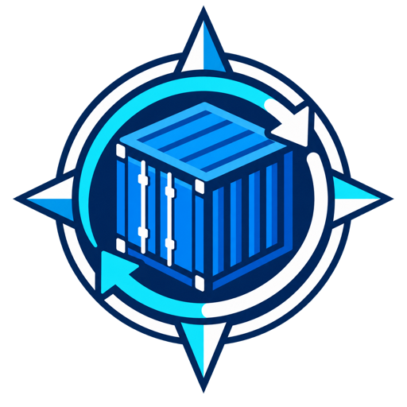

<p align="center"><strong>English</strong> | <a href="README.de.md">Deutsch</a></p>

<div align="center">
  
  <h1>Container Pilot</h1>
  <p><strong>Controlled Docker Updates</strong></p>
  <p>A Docker update manager with a Web UI, per-container policies, health checks, and automatic rollback.</p>
  <p><strong>A safer Watchtower alternative focused on control and recovery.</strong></p>
  <p>
    
    
    
    
  </p>
</div>

> **Watchtower automates updates. Container Pilot manages updates.**

Container Pilot detects Docker image updates, lets administrators approve or automate them per container, validates the replacement container, and restores the previous container automatically when startup or health validation fails.

The project is currently a **release candidate**. Test it with non-critical workloads before enabling automatic updates broadly.

## Quick start

Requirements: Docker Engine, Docker Compose, and a trusted internal management network.

```bash
mkdir container-pilot && cd container-pilot
mkdir -p secrets
openssl rand -base64 32 > secrets/admin_password
chmod 600 secrets/admin_password
curl -fsSLO https://raw.githubusercontent.com/DeepZone/container-pilot/main/compose.yml
docker compose pull
docker compose up -d
```

Open `http://YOUR-DOCKER-HOST:3080`. The initial account is `admin`; its generated password is stored in `secrets/admin_password`. Change the password after the first login.

> Container Pilot requires write access to `/var/run/docker.sock`. Treat administrator access to its Web UI as privileged access to the Docker host. Do not expose it directly to the public Internet.

See [Installation](docs/installation.md) for localhost binding, upgrades, and a minimal Compose example.

## Why Container Pilot?

The core workflow is deliberately small:

```text
Detect → Decide → Update → Verify → Recover
```

- Web UI for running and stopped containers
- Docker Hub and public GHCR update detection
- Manual updates and configurable automatic checks
- Explicit automatic-update policy per container
- Fixed-tag updates without silently switching to `latest`
- Optional, confirmed switch to `latest`
- Docker healthcheck validation and startup stability checks
- Automatic recovery when an update does not become ready
- Manual rollback to the previous image digest
- Explicit disposal of an unused rollback image
- Event history and per-container action locks
- Administrator and read-only viewer roles
- Container configuration reconstruction, including mounts, networks, ports, environment, and restart policy
- Safe self-update flow through a separate helper container

## Important safety boundary

An image rollback does **not** restore volumes, databases, or application data. An updated application may perform an irreversible database migration before a failed healthcheck is detected. Create application-aware backups before major upgrades or automatic updates of stateful services.

Container Pilot also cannot modify external Compose files. A later `docker compose up` may restore the image reference declared in that Compose project.

Read [Security](docs/security.md), [Updates](docs/updates.md), and [Rollback](docs/rollback.md) before enabling unattended updates.

## Documentation

- [Installation](docs/installation.md)
- [Configuration](docs/configuration.md)
- [Security model](docs/security.md)
- [Update behavior](docs/updates.md)
- [Rollback behavior](docs/rollback.md)
- [Reverse proxy setup](docs/reverse-proxy.md)
- [Troubleshooting](docs/troubleshooting.md)
- [Roadmap](ROADMAP.md)
- [Changelog](CHANGELOG.md)

Migration and factual product comparisons are being prepared separately so that claims can be verified against current upstream documentation.

## Images and release channels

Published multi-architecture images are available from:

```text
ghcr.io/deepzone/container-pilot
```

- Versioned tags such as `0.9.0-rc.6` are immutable release references.
- Release candidates use the `rc` channel once published by the release workflow.
- `latest`, major, and minor aliases are reserved for stable releases.

Supported platforms: `linux/amd64` and `linux/arm64`.

## Development and tests

```bash
git clone https://github.com/DeepZone/container-pilot.git
cd container-pilot
npm test
```

The Docker integration suite creates isolated fixture containers, volumes, and networks:

```bash
npm run test:integration
```

## Current limitations

- Private registries are not supported yet.
- Registry inspection currently targets Docker Hub and public GHCR images.
- Containers without a Docker healthcheck can only be observed for process stability during the configured startup grace period.
- Technical health does not replace application-specific end-to-end testing.
- The Web UI currently uses German text; English UI support is planned.

## Contributing and security

Contributions are welcome. Read [CONTRIBUTING.md](CONTRIBUTING.md) before opening a pull request.

Do not publish credentials, tokens, private image names, internal addresses, or complete state files in issues. Report vulnerabilities according to [SECURITY.md](SECURITY.md).

## License and copyright

Copyright © 2026 NoiSens Media.

Container Pilot is released under the [MIT License](LICENSE).
